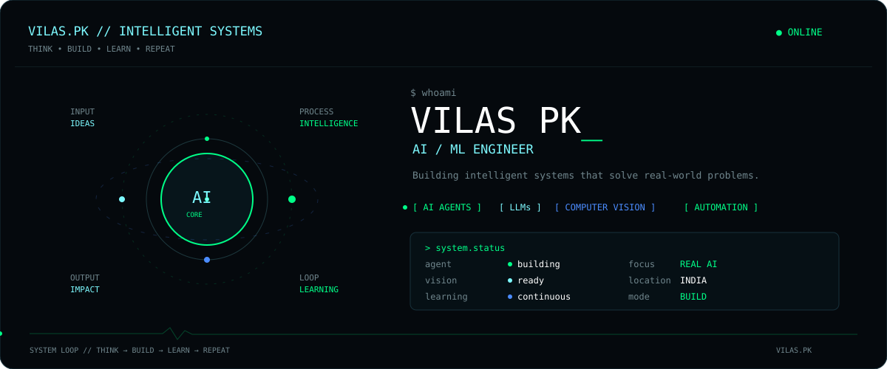

## `featured_projects`

| Project | Focus |
|---|---|
| [Integrated AI Assistant](https://github.com/VILAS07/Integrated-AI-Assistant-for-Visually-Impaired-People) | Computer Vision · LLMs · Accessibility |
| [Meeting-Agent](https://github.com/VILAS07/Meeting-Agent) | LLMs · Agents · NLP |
| [VMExitReport](https://github.com/VILAS07/vmexitreport) | Automation · Reporting · DevOps |
| [Transaction Reconciliation](https://github.com/VILAS07/transaction-reconciliation-system) | Python · Streamlit · Data |
| [Sign Language Recognition](https://github.com/VILAS07/Sign-Language-Recogonition) | Deep Learning · Computer Vision |

## `toolbox`

`Python` · `PyTorch` · `TensorFlow` · `OpenCV` · `LLMs` · `AI Agents` · `React` · `TypeScript` · `Linux` · `Git`

## `connect`

[GitHub](https://github.com/VILAS07) · [Portfolio](https://github.com/VILAS07/Portfolio) · [LinkedIn](https://www.linkedin.com/) · [Email](mailto:)

---

`THINK → BUILD → LEARN → REPEAT`

